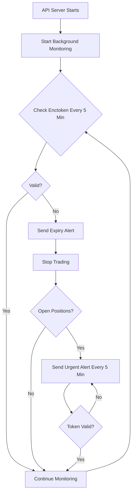

# Email Alert Setup Guide

This guide explains how to configure email alerts for your Kite Trading Bot. Email alerts will notify you when your enctoken expires, especially critical when you have open positions.

## Features

- **Automatic Enctoken Monitoring**: Checks token validity every 5 minutes
- **Instant Expiry Alerts**: Get notified immediately when enctoken expires
- **Open Position Alerts**: Recurring alerts every 5 minutes if positions are open with expired token
- **Trading Auto-Pause**: Automatically stops trading when enctoken becomes invalid
- **Login Modal**: Dashboard automatically shows login form when token expires

---

## Email Configuration

### Step 1: Choose Email Provider

You can use any SMTP email service. Popular options:

#### Gmail (Recommended for personal use)

1. Enable 2-Factor Authentication on your Google account
2. Generate an App Password:
   - Go to https://myaccount.google.com/apppasswords
   - Select "Mail" and "Other (Custom name)"
   - Copy the 16-character password

**Configuration:**
```bash
EMAIL_HOST="smtp.gmail.com"
EMAIL_PORT="587"
EMAIL_USER="your-email@gmail.com"
EMAIL_PASS="xxxx xxxx xxxx xxxx"  # App Password
EMAIL_TO="your-email@gmail.com"
```

#### Outlook/Hotmail

**Configuration:**
```bash
EMAIL_HOST="smtp-mail.outlook.com"
EMAIL_PORT="587"
EMAIL_USER="your-email@outlook.com"
EMAIL_PASS="your-password"
EMAIL_TO="your-email@outlook.com"
```

#### Custom SMTP Server

If you have your own SMTP server:
```bash
EMAIL_HOST="smtp.yourdomain.com"
EMAIL_PORT="587"  # or 465 for SSL
EMAIL_USER="bot@yourdomain.com"
EMAIL_PASS="your-smtp-password"
EMAIL_TO="alerts@yourdomain.com"
```

---

### Step 2: Configure via Dashboard (Recommended)

1. Open dashboard: `http://localhost:3000` (or your server URL)

2. Add "Email Configuration" card to sidebar (will be added in UI)

3. Fill in the form:
   - **SMTP Host**: Your email provider's SMTP server
   - **SMTP Port**: Usually 587 (TLS) or 465 (SSL)
   - **Username**: Your email address
   - **Password**: Your email password or app password
   - **Alert Email**: Where to send alerts (can be same or different)

4. Click "Save Configuration"

5. Click "Send Test Email" to verify

---

### Step 3: Configure via API (Alternative)

```bash
curl -X POST http://localhost:3000/api/email/config \
  -H "Content-Type: application/json" \
  -d '{
    "host": "smtp.gmail.com",
    "port": 587,
    "user": "your-email@gmail.com",
    "pass": "your-app-password",
    "to": "your-email@gmail.com"
  }'
```

**Response:**
```json
{
  "success": true,
  "message": "Email configuration saved"
}
```

---

### Step 4: Configure Manually (File-based)

Create a file named `.env.email` in the project root:

```bash
cat > .env.email << 'EOF'
EMAIL_HOST="smtp.gmail.com"
EMAIL_PORT="587"
EMAIL_USER="your-email@gmail.com"
EMAIL_PASS="xxxx xxxx xxxx xxxx"
EMAIL_TO="your-email@gmail.com"
EOF

# Secure the file
chmod 600 .env.email
```

---

## Testing Email Configuration

### Via Dashboard

1. Go to Email Configuration section
2. Click "Send Test Email"
3. Check your inbox

### Via API

```bash
curl -X POST http://localhost:3000/api/email/test
```

**Success Response:**
```json
{
  "success": true,
  "message": "Test email sent successfully"
}
```

**Check your email** - you should receive:
```
Subject: 🤖 Kite Trading Bot: Test Alert
Body: This is a test email from your Kite Trading Bot.
```

---

## Email Alert Types

### 1. Enctoken Expired Alert

**Trigger**: When enctoken becomes invalid

**Example:**
```
Subject: 🤖 Kite Trading Bot: Enctoken Expired - Action Required

Your Kite enctoken has expired or become invalid.

Error: Enctoken is expired or invalid

Please login again to resume trading:
http://localhost:3000

Trading has been automatically stopped.
```

### 2. Open Positions with Expired Token

**Trigger**: Every 5 minutes if positions are open and token is expired

**Example:**
```
Subject: 🤖 Kite Trading Bot: URGENT: Open Positions with Expired Enctoken

You have 2 open position(s) but your enctoken is expired!

Open Positions:
- SILVERM25FEBFUT: 50 qty, P&L: ₹2,450.00
- NIFTY25JAN24000CE: -100 qty, P&L: ₹-1,200.00

IMMEDIATE ACTION REQUIRED:
1. Login to dashboard: http://localhost:3000
2. Update your enctoken
3. Monitor/close your positions

This alert will repeat every 5 minutes until enctoken is valid.
```

---

## How It Works

### Background Monitoring

The API server automatically monitors enctoken validity:

```
┌─────────────────────────────────────────────────────┐
│                                                     │
│  Every 5 minutes:                                   │
│  ├─ Check enctoken validity with Kite API          │
│  ├─ If invalid:                                     │
│  │  ├─ Send email alert                            │
│  │  ├─ Stop trading process                        │
│  │  └─ Check for open positions                    │
│  └─ If positions open:                             │
│     └─ Send recurring alert every 5 minutes        │
│                                                     │
└─────────────────────────────────────────────────────┘
```

### Frontend Auto-Login

When you open the dashboard:

```
┌─────────────────────────────────────────────────────┐
│                                                     │
│  On page load:                                      │
│  ├─ Check enctoken validity                        │
│  ├─ If invalid:                                     │
│  │  └─ Show login modal (blocks UI)                │
│  └─ If valid:                                       │
│     └─ Show normal dashboard                       │
│                                                     │
│  Every 5 minutes:                                   │
│  └─ Recheck enctoken validity                      │
│                                                     │
└─────────────────────────────────────────────────────┘
```

---

## Security Best Practices

### 1. Use App Passwords

For Gmail, **never use your actual password**. Always create an App Password:
- More secure
- Can be revoked without changing main password
- Limited scope

### 2. Secure Configuration File

```bash
# Always set proper permissions
chmod 600 .env.email

# Never commit to git
echo ".env.email" >> .gitignore
```

### 3. Use Dedicated Email

Consider using a separate email account for bot alerts:
- Isolates bot-related emails
- Easier to filter/organize
- Better security if compromised

### 4. Environment Variable (Production)

For production/cloud deployment, use environment variables:

```bash
# .bashrc or .profile
export EMAIL_HOST="smtp.gmail.com"
export EMAIL_PORT="587"
export EMAIL_USER="bot@example.com"
export EMAIL_PASS="app-password"
export EMAIL_TO="alerts@example.com"
```

Or in Docker:
```yaml
# docker-compose.yml
environment:
  - EMAIL_HOST=smtp.gmail.com
  - EMAIL_PORT=587
  - EMAIL_USER=${EMAIL_USER}
  - EMAIL_PASS=${EMAIL_PASS}
  - EMAIL_TO=${EMAIL_TO}
```

---

## Troubleshooting

### Issue 1: Test Email Not Received

**Check:**
```bash
# Check configuration
curl http://localhost:3000/api/email/status

# Should return:
{
  "success": true,
  "data": {
    "configured": true,
    "host": "smtp.gmail.com",
    "user": "your-email@gmail.com",
    "to": "your-email@gmail.com"
  }
}
```

**Common fixes:**
1. Check spam/junk folder
2. Verify SMTP credentials
3. For Gmail: Enable "Less secure app access" or use App Password
4. Check firewall/network allows outbound SMTP

### Issue 2: "Authentication failed" error

**Gmail:**
- Use App Password, not regular password
- Enable 2-Factor Authentication first
- Check "Allow less secure apps" is ON (if not using app password)

**Outlook:**
- Ensure account is not locked
- Check password is correct
- May need to enable "SMTP AUTH" in account settings

### Issue 3: Email alerts not being sent

**Check logs:**
```bash
# Check if monitoring is running
tail -f logs/supervisor.log | grep -i "monitoring\|email"

# Should see:
[2025-01-24 10:00:00] [INFO] Background monitoring started (enctoken check: 5min, cache cleanup: 1hr)
[2025-01-24 10:05:00] [INFO] Email alert sent: Enctoken Expired - Action Required
```

**Verify monitoring is active:**
```bash
# Should show enctoken check API calls every 5 minutes
curl http://localhost:3000/api/status
```

### Issue 4: Too many email alerts

If you're getting too many alerts:

1. **Check enctoken validity:**
   ```bash
   curl http://localhost:3000/api/enctoken/validate
   ```

2. **Login to refresh token:**
   - Open http://localhost:3000
   - Modal will appear if token is invalid
   - Enter credentials and 2FA code

3. **Alerts will stop** once token is valid again

---

## API Endpoints

### Configure Email
```http
POST /api/email/config
Content-Type: application/json

{
  "host": "smtp.gmail.com",
  "port": 587,
  "user": "your-email@gmail.com",
  "pass": "app-password",
  "to": "your-email@gmail.com"
}
```

### Get Email Status
```http
GET /api/email/status

Response:
{
  "success": true,
  "data": {
    "configured": true,
    "host": "smtp.gmail.com",
    "user": "your-email@gmail.com",
    "to": "your-email@gmail.com"
  }
}
```

### Send Test Email
```http
POST /api/email/test

Response:
{
  "success": true,
  "message": "Test email sent successfully"
}
```

### Validate Enctoken
```http
GET /api/enctoken/validate

Response:
{
  "success": true,
  "data": {
    "valid": true,
    "user": "AB1234",
    "userName": "John Doe",
    "email": "john@example.com"
  }
}
```

### Get Open Positions
```http
GET /api/positions

Response:
{
  "success": true,
  "data": {
    "positions": [
      {
        "tradingsymbol": "SILVERM25FEBFUT",
        "quantity": 50,
        "pnl": 2450.50,
        ...
      }
    ],
    "count": 1
  }
}
```

---

## Email Alert Workflow



---

## Complete Setup Checklist

- [ ] Email provider chosen (Gmail recommended)
- [ ] App Password generated (if using Gmail)
- [ ] Email configuration added via dashboard/API/file
- [ ] Test email sent and received successfully
- [ ] Enctoken validation working (check `/api/enctoken/validate`)
- [ ] Background monitoring started (check logs)
- [ ] Login modal appears when token is invalid
- [ ] Email alerts received when token expires
- [ ] Recurring alerts work when positions are open

---

## Next Steps

After email setup:

1. **Monitor logs** to see background checks:
   ```bash
   tail -f logs/supervisor.log
   ```

2. **Test the flow**:
   - Wait for enctoken to expire (or manually delete it)
   - Check email for alert
   - Open dashboard - should see login modal
   - Login to refresh token
   - Verify trading resumes

3. **Set up mobile notifications**:
   - Add email to your phone's mail app
   - Enable push notifications for this email
   - Get instant alerts on your mobile device

4. **Deploy to cloud** (optional):
   - Follow [CLOUD_DEPLOYMENT.md](CLOUD_DEPLOYMENT.md)
   - Ensure email configuration is included in deployment
   - Test email alerts from cloud server

---

## Support

If you encounter issues:

1. Check logs: `tail -f logs/supervisor.log`
2. Test API endpoints: `curl http://localhost:3000/api/email/status`
3. Verify SMTP credentials are correct
4. Check spam/junk folder
5. Review error messages in logs

---

**Email alerts are now configured! You'll be notified immediately if your enctoken expires, especially critical when you have open trading positions.**
